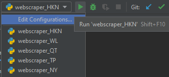

# py-autoscreenshotter
*If a picture speaks a thousand words, a video publishes a dictionary - yeozhenhao*

### Watch my [Youtube video on this coding project](https://youtu.be/8ZPajQafiF4) for the <u>demonstration</u> and to learn more about the <u>challenges</u> in creating this!

## Set-up Basics (in photos)
*If you are an experienced coder you can skip this step & go on to Set-up Advanced section*\

***Note: the photos shown are ONLY FOR REFERENCE - the photos may not exactly match the steps described.***

####
**1. Install Python**\
*[Official Download Link](https://www.python.org/downloads)*

**2. Install PyCharm**\
*Community Edition is free on MacOS and Windows*

**3. Install Git for Windows (MacOS users can skip this step)**\
*Git for Windows can be installed [here](https://gitforwindows.org)*\
*We need the "git clone" in the Command Prompt application on Windows / Terminal application on MacOS to copy this entire repository*

**4. Open Command Prompt (on Windows) / Terminal (on MacOS) and use "git clone <my repository link>" to clone the files of this repository**\
A. After opening command prompt, choose the directory you want these script files to be cloned (aka downloaded) into by using the "cd" command. For example ype cd "C:\Users\YOUR-USER\Documents\PythonProjects" if you want to download the files into the PythonProjects folder in the Documents folder.

B. Clone the repository: *Open the main page of the repository in browser. click Clone or download. Then, click the Copy icon to copy the clone URL for the repository.*\
[See the first two steps in this tutorial if you don't know what I mean](https://blogs.sap.com/2019/07/12/how-to-clone-a-github-repository-to-local-mac-computer/)

***These are the commands you should type in your Command Prompt:***\


**~Tada! The script files have been downloaded into your computer.

**5. Open PyCharm, then click "File" (in the top left corner), then click "Open", then select the "webscraper_2022" folder, then click "OK".**\
*This will open up the entire script as a project*

**6. You need to install the required modules in your project environment to run the scripts.**\
You may use ***requirements.txt*** when **PyCharm** automatically detects it in the project *(but module versions may not be the latest)*, **OR** do the following to get the latest versions of the required modules:\
A. Click "File" (in the top left corner), then click "Settings".

B. Click the "Project Interpreter" under the Project Tab on the left, then click Python Interpreter dropdown list, then click "Show All"\


C. Click the plus ("+") sign to add a new virtual environment for your project, then select "Virtualenv Environment" on the left.

D. Ensure that *"New Environment"* is selected *(unless for some reason you've already set up the environment before, then PyCharm will force you to edit the "Existing Environment" instead).*\
\
Then, ensure that you choose the correct location (which should point to a venv folder in your project folder, and that your Base Interpreter is also pointing to the *Python.exe* that you have just installed.\
\
Then click "OK".\


E. You should now be in the Select Virtual Environment window. Select the Virtual Environment you've just created, and click "OK".\


F. Now go to the Project Settings screen (with "Python Interpreter" tab selected), ensure that you chose the correct Python Interpreter, then click the plus ("+") sign to install all the required modules.\


E. The required modules are:
- *opencv-python*
- *PyAutoGUI*
- *pywin32*
- *Pillow*
- *scipy*
- *numpy*

\
\
Then click "Install Package" to install each module. Do this for all required modules, then click "OK" in the Project Settings window.\
\
***Your PyCharm project has now installed all the required modules!***

***Your PyCharm project (click the "Project" tab on the left in PyCharm) should look something like this:***\


**~Now your scripts are ready to be run!**

## Set-up Advanced (in photos)
**Some notes:**
- There are two scripts available: autoscreenshotter_MSTeams.py is for MS_Teams, autoscreenshotter.py is for Microsoft Word. But honestly they can be duplicated and edited to be used for any other note-taking app like OneNote, or another meeting application. 

**1.** Before you can run the script, you need to replace ALL of the pictures in the **pics** folder with **screenshots** of your icon on your computer; as the colours of my icon may not exactly match the colours of your respective icons. The icons are markers of the top-left corner of your respective windows.
- *MSTeamsicon.png* is ANY **UNIQUE** icon on the top-left of your **MS Teams meeting window**
- *saveicon.png* is ANY **UNIQUE** icon on the top-left of your **Microsoft Word window** or window of any other note-taking application
- *zoomicon.png* is ANY **UNIQUE** icon on the top-left of your **Zoom meeting window**


**2.** You need to set the correct settings for every lecture. Every setting you need is at the top of the script.
- **SS_size_x, SS_size_y:** Size of the screenshot. These values are in pixels.
- **SS_loc_offset_x, SS_loc_offset_y:** The **rightward** and **downward** distances respectively **from the icon**. The destination point is where the **upper-left corner of the screenshot** will be. These values are in pixels.
- **pause_time:** The time interval (in seconds) between every time it takes a screenshot and checks if it should copy over the screenshot into your notes.
- **zoom_pic_file_loc, Word_save_icon_file_loc:** The respective icons used to determine the upper-left corner
- **black_threshold (Default = 50):** The threshold **<sum of RGB array>** under which the script should assume that the pixel is totally black. For example, an RGB array of (12,13,14) gives 39 which is <50 (default value), and thus should be considered as totally black. The **higher** the value, the **less** sensitive this script will be to detect differences between screenshots.
- **percentage_black_threshold (Default = 98%):** A marker for threshold **percentage similarity** between two screenshots. If the similarity between screenshots is < 98% (default value), then the script will copy over the screenshot it took every time interval into your note-taking app. The **higher** the value, the **more** sensitive this script will be to detect differences between screenshots.
- Ignore the following settings as they are useless. They were used while I was spending days to find out how to reliably compare differences between images.
```
resize_img_smaller = False
resize_to = (100, 56)
convert_img_to_grayscale = False
normalise_img = False
## USELESS VARIABLES - IGNORE
# z_norm_diff_cutoff = 1900
fail_safe_boolean = False
```

3. You're done! Now simply run the script, go back to sleep, and remember to set your alarm to the end of the lecture :^)\
*Enjoy*~~\
